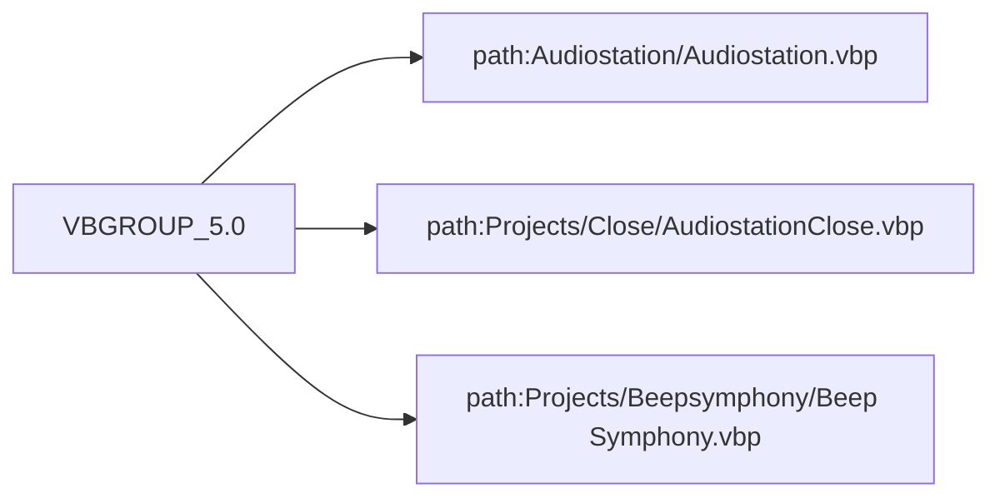

# Documentação do arquivo VBGROUP 5.0

## Introdução

Este é o arquivo de agrupamento de projeto para a versão 5.0 do VBGROUP. Ele é responsável por agrupar e iniciar os projetos Audiostation, AudiostationClose e Beep Symphony.

## Estrutura

O arquivo possui uma estrutura simples, onde cada linha representa um projeto contido no grupo ou uma configuração do grupo.

## Imports

Este arquivo não contém imports.

## Variáveis

Este arquivo não contém variáveis.

## Dependências

Este arquivo depende dos seguintes projetos:

- Audiostation\Audiostation.vbp
- Projects\Close\AudiostationClose.vbp
- Projects\Beepsymphony\Beep Symphony.vbp

## Métodos

Este arquivo não contém métodos.

## Exemplo

Este arquivo é geralmente usado para iniciar todos os projetos contidos no grupo ao mesmo tempo. Para isso, basta abrir o arquivo VBGROUP 5.0.

## Diagrama de dependências

## Notas

Não há notas adicionais sobre este arquivo.

## Vulnerabilidades

Não foram identificadas vulnerabilidades neste arquivo.