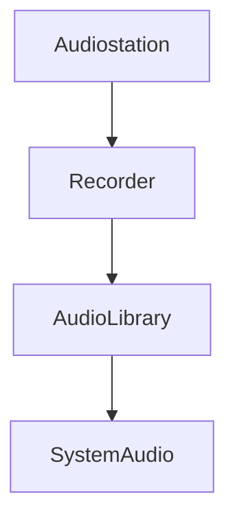

# Documentação do arquivo Audiostation Recorder.vbp

## Introdução

Este arquivo é parte do projeto Audiostation, especificamente do módulo Recorder. Ele é responsável por gerenciar as operações de gravação de áudio.

## Dependências

Este arquivo depende de outros arquivos e módulos do projeto Audiostation.

## Estrutura

O arquivo é estruturado em uma série de métodos e funções relacionados à gravação de áudio.

## Imports

O arquivo importa várias bibliotecas e módulos necessários para a gravação de áudio.

## Variáveis

As variáveis neste arquivo estão relacionadas aos parâmetros de gravação de áudio, como taxa de amostragem, bitrate, etc.

## Métodos

Os métodos neste arquivo são usados para iniciar, parar e pausar a gravação, bem como para definir e obter os parâmetros de gravação.

## Exemplo

Um exemplo de uso deste arquivo seria iniciar uma gravação, definir a taxa de amostragem e o bitrate, gravar por um determinado período de tempo e, em seguida, parar a gravação.

## Diagrama de dependências

## Notas

Este arquivo é crítico para a funcionalidade de gravação do projeto Audiostation.

## Vulnerabilidades

Não foram identificadas vulnerabilidades específicas neste arquivo. No entanto, como em qualquer software, é importante garantir que as entradas sejam validadas corretamente para evitar problemas de segurança.