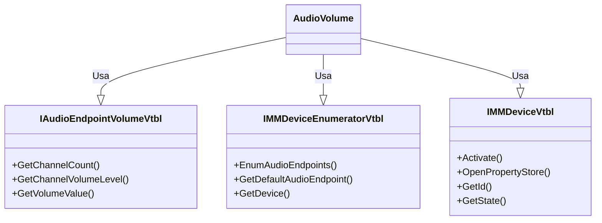

# Documentação do arquivo AudioVolume

## Introdução

O arquivo AudioVolume é responsável por gerenciar o volume do áudio do sistema. Ele contém diversos métodos para obter e ajustar o volume, bem como controlar o estado de mudo do sistema de áudio.

## Dependências

Este arquivo não possui dependências externas.

## Estrutura

Este arquivo contém várias constantes, tipos de dados, declarações de função e métodos de classe que são usados para gerenciar o volume do áudio do sistema.

## Imports

Este arquivo não importa nenhum outro arquivo.

## Variáveis

As variáveis neste arquivo são usadas principalmente para armazenar ponteiros para interfaces COM e resultados de chamadas de função.

## Métodos

Este arquivo contém vários métodos para gerenciar o volume do áudio do sistema, incluindo métodos para obter e definir o volume do canal e do mestre, obter e definir o estado de mudo, registrar e cancelar o registro de callbacks de mudança de controle, e incrementar e decrementar o volume.

## Exemplo

Aqui está um exemplo de como você pode usar este arquivo para ajustar o volume do áudio do sistema:

```vb
Dim audioVolume As New AudioVolume
audioVolume.SetMasterVolumeLevelScalar(0.5) ' Define o volume do mestre para 50%
```

## Diagrama de dependências



## Notas

Este arquivo usa muitas chamadas de API do Windows e interfaces COM para gerenciar o volume do áudio do sistema.

## Vulnerabilidades

Como este arquivo faz chamadas diretas para as APIs do Windows, ele pode ser suscetível a vulnerabilidades se não for usado corretamente. Sempre certifique-se de verificar os valores retornados das chamadas de função e lidar adequadamente com quaisquer erros.