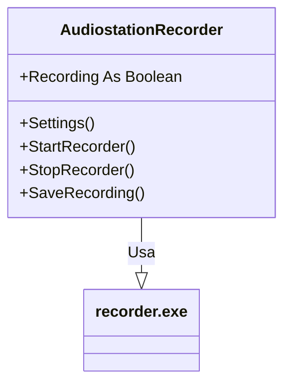

# Documentação do arquivo AudiostationRecorder

## Introdução
Este arquivo adiciona funcionalidades de gravação ao programa Audiostation. Foi criado por Alex van den Berg da Sibra-Soft em 25 de junho de 2022.

## Dependências
Este arquivo depende do `recorder.exe` para funcionar corretamente.

## Estrutura
Este arquivo é composto por uma classe chamada `AudiostationRecorder` que contém quatro métodos (`Settings`, `StartRecorder`, `StopRecorder`, `SaveRecording`) e uma variável pública (`Recording`).

## Imports
Não há imports neste arquivo.

## Variáveis
### Recording (Público)
Uma variável booleana que indica se a gravação está ativa ou não.

## Métodos
### Settings()
Este método executa o comando `recorder.exe -settings`.

### StartRecorder()
Este método inicia a gravação através do comando `recorder.exe -record` e altera o estado da variável `Recording` para `True`.

### StopRecorder()
Este método para a gravação através do comando `recorder.exe -stop` e altera o estado da variável `Recording` para `False`.

### SaveRecording()
Este método para a gravação (através da chamada do método `StopRecorder`) e salva a gravação através do comando `recorder.exe -save`.

## Exemplo
```vba
Dim recorder As New AudiostationRecorder
recorder.StartRecorder
'... fazer algo ...
recorder.SaveRecording
```

## Diagrama de dependências


## Notas
Tenha certeza de que o `recorder.exe` está no mesmo diretório do seu programa para que os métodos funcionem corretamente.

## Vulnerabilidades
Não há vulnerabilidades conhecidas neste arquivo.