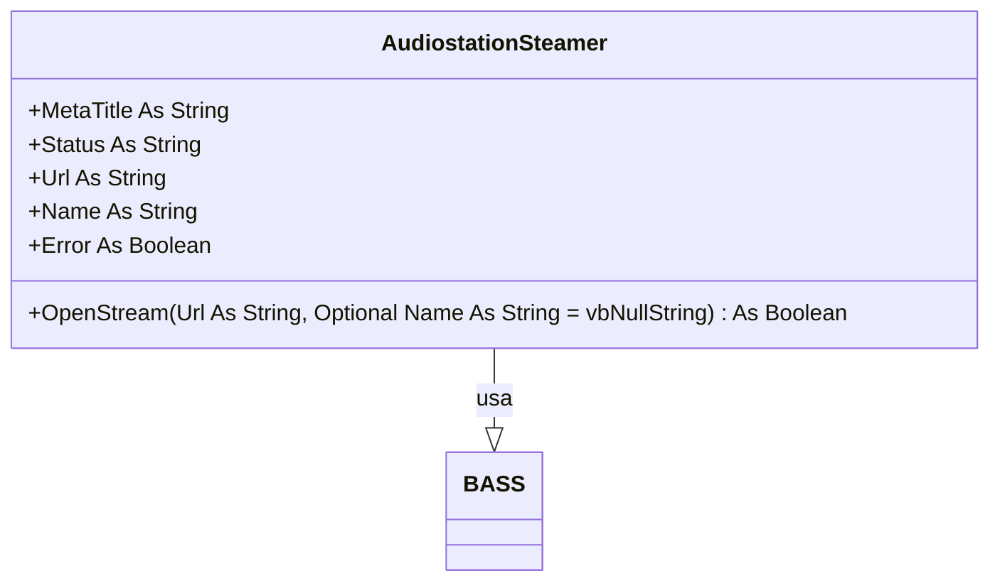

# Documentação do arquivo AudiostationSteamer

## Introdução

O arquivo AudiostationSteamer é uma classe que adiciona funcionalidades de transmissão para o programa Audiostation. Foi criado por Alex van den Berg da Sibra-Soft em 04-10-2021.

## Dependências

Este arquivo depende das seguintes bibliotecas:

- BASS

## Estrutura

Este arquivo é composto por variáveis públicas e uma função.

## Variáveis

As variáveis no arquivo são:

- `MetaTitle` - String que armazena o título da metainformação.
- `Status` - String que armazena o status da transmissão.
- `Url` - String que armazena a URL da transmissão.
- `Name` - String que armazena o nome da transmissão.
- `Error` - Booleano que indica se ocorreu um erro.

## Métodos

Este arquivo possui o seguinte método:

- `OpenStream(Url As String, Optional Name As String = vbNullString)` - Este método tenta abrir uma transmissão a partir da URL fornecida. Se não conseguir abrir a transmissão, ele exibe uma mensagem de erro e retorna False. Se conseguir abrir a transmissão, ele retorna True.

## Exemplo

Para usar a classe AudiostationSteamer, você pode fazer algo assim:

```vba
Dim streamer As New AudiostationSteamer
Dim url As String
Dim name As String

url = "http://example.com/stream"
name = "My Stream"

If streamer.OpenStream(url, name) Then
    MsgBox "Stream opened successfully"
Else
    MsgBox "Failed to open stream"
End If
```

## Diagrama de dependências



## Notas

Nenhuma nota adicional.

## Vulnerabilidades

Nenhuma vulnerabilidade conhecida.