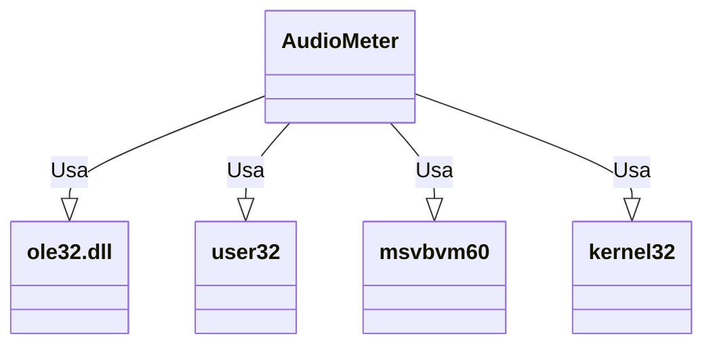

# Documentação do arquivo AudioMeter

## Introdução

Este arquivo contém a implementação de um medidor de áudio. Ele utiliza várias funções e constantes para obter informações sobre o áudio, como o valor de pico e o valor de pico por canal.

## Dependências

Este arquivo depende das bibliotecas `ole32.dll`, `user32`, `msvbvm60` e `kernel32`.

## Estrutura

O arquivo é estruturado em várias partes, com declarações de tipos privados e enumerações, declarações de variáveis privadas, inicialização e término da classe, e várias funções privadas e públicas.

## Imports

Este arquivo importa várias funções de várias bibliotecas DLL, como `OleInitialize` e `OleUninitialize` da `ole32.dll`, `CallWindowProc` da `user32`, `PutMem2`, `PutMem4` e `GetMem4` da `msvbvm60`, e `GlobalAlloc` e `GlobalFree` da `kernel32`.

## Variáveis

Este arquivo declara várias variáveis privadas, como `c_lngObjDevEnumerator`, `c_lngObjIMMDevice`, `c_lngObjAudioMeterInformation`, e `c_blnInitialized`.

## Métodos

Este arquivo contém vários métodos, incluindo `Class_Initialize`, `Class_Terminate`, `IsVista`, `GetPeak`, `GetChannelPeak`, e `CallInterface`.

## Exemplo

Para usar esta classe, você pode criar uma instância dela e chamar seus métodos públicos, como `GetPeak` e `GetChannelPeak`.

```vba
Dim meter As New AudioMeter
Dim peak As Single
peak = meter.GetPeak()
```

## Diagrama de dependências



## Notas

Este arquivo usa a versão 6.0 do Visual Basic para Aplicações (VBA) e requer o Windows Vista ou versões posteriores.

## Vulnerabilidades

Não foram identificadas vulnerabilidades específicas neste arquivo.