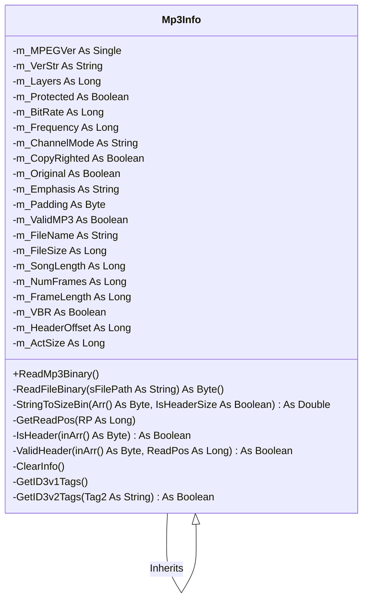

# Documentação do arquivo Mp3Info

## Introdução

Esta classe representa um arquivo MP3 e fornece funcionalidades para ler e manipular informações sobre o arquivo, como bitrate, frequência, tempo de música, número de quadros e outros detalhes do cabeçalho MP3.

## Dependências

Esta classe não tem dependências externas.

## Estrutura

A classe possui vários métodos e variáveis privadas para armazenar e manipular informações sobre o arquivo MP3.

## Imports

Esta classe não importa nenhum módulo ou biblioteca externa.

## Variáveis

A classe tem várias variáveis privadas que armazenam informações sobre o arquivo MP3, como bitrate, frequência, tempo de música, número de quadros, etc.

## Métodos

A classe possui vários métodos privados para ler e manipular informações do arquivo MP3. Além disso, possui um método público `ReadMp3Binary` que inicia a leitura do arquivo MP3.

## Exemplo

```vba
Dim mp3Info As New Mp3Info
mp3Info.Filename = "path_to_your_mp3_file"
mp3Info.ReadMp3Binary
```

## Diagrama de dependências



## Notas

A classe foi escrita em VBA e pode não ser compatível com todas as versões do Microsoft Office.

## Vulnerabilidades

A classe não valida o caminho do arquivo passado para o método `ReadMp3Binary`, portanto, deve-se ter cuidado ao passar argumentos para esse método. Além disso, a classe não lida com exceções que podem ocorrer durante a leitura do arquivo.