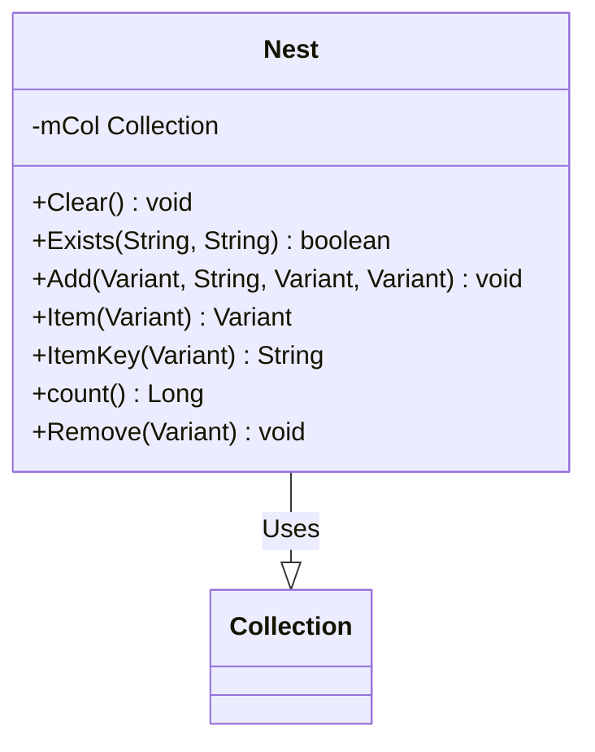

# Documentação do arquivo Nest

## Introdução

A classe `Nest` é uma extensão da classe de dicionário incorporada. Ela foi criada para fornecer funcionalidades adicionais e manipulação mais eficiente dos elementos da coleção.

## Dependências

Nenhuma dependência externa é necessária para esta classe.

## Estrutura

A classe `Nest` é composta por métodos e propriedades privadas e públicas. As propriedades privadas incluem `mCol`, que é uma coleção que armazena os elementos. Os métodos públicos incluem `Clear`, `Exists`, `Add`, `Item`, `ItemKey`, `count` e `Remove`.

## Imports

Nenhum import é necessário para essa classe.

## Variáveis

- `mCol`: Uma variável privada que representa a coleção que armazena os elementos.

## Métodos

- `Clear()`: Limpa a coleção.
- `Exists(sItem, sKey)`: Verifica se um item ou chave existe na coleção.
- `Add(Item, sKey, Before, After)`: Adiciona um item à coleção com uma chave opcional, antes ou depois de um elemento.
- `Item(vntIndexKey)`: Retorna o item na posição `vntIndexKey`.
- `ItemKey(vntIndexKey)`: Retorna a chave do item na posição `vntIndexKey`.
- `count()`: Retorna o número de elementos na coleção.
- `Remove(vntIndexKey)`: Remove o elemento na posição `vntIndexKey`.

## Exemplo

```vb
Dim nest As New Nest
nest.Add "Item1", "Key1"
nest.Add "Item2", "Key2"
If nest.Exists(sKey:="Key1") Then
    Debug.Print "Key1 exists"
End If
Debug.Print nest.count
nest.Remove "Key1"
Debug.Print nest.count
```

## Diagrama de dependências



## Notas

Este código foi escrito por Sibra-Soft - Alex van den Berg, e foi criado em 15-11-2020 e alterado pela última vez em 05-10-2021.

## Vulnerabilidades

Nenhuma vulnerabilidade conhecida foi identificada nesta classe.