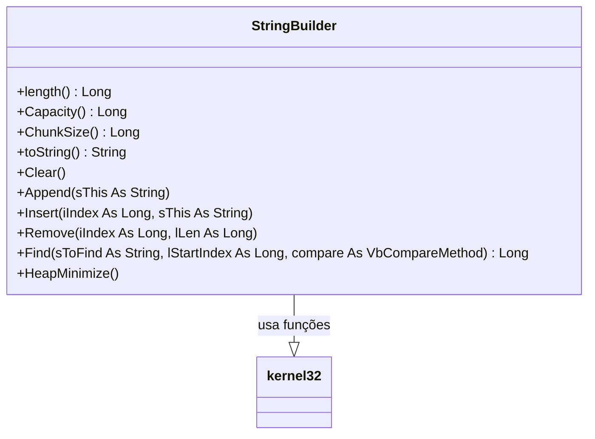

# Documentação do arquivo StringBuilder

## Introdução

Este arquivo define a classe "StringBuilder", que funciona de forma semelhante à classe StringBuilder do .NetFramework. O código foi criado por Alex van den Berg da Sibra-Soft em 22 de setembro de 2021 e foi alterado pela última vez em 5 de outubro de 2021.

## Dependências

O código depende da biblioteca "kernel32" do Windows para a função "RtlMoveMemory".

## Estrutura

A classe "StringBuilder" é composta por vários métodos e propriedades que permitem manipular e gerenciar strings de maneira eficiente.

## Imports

O código importa a função "RtlMoveMemory" da biblioteca "kernel32" do Windows.

## Variáveis

O código possui várias variáveis privadas para gerenciar a string, incluindo `m_sString` para armazenar a string atual, `m_iChunkSize` para armazenar o tamanho do pedaço de string a ser manipulado, e `m_iPos` e `m_iLen` para controlar a posição e o comprimento da string, respectivamente.

## Métodos

A classe "StringBuilder" possui vários métodos para manipular strings, incluindo `Clear`, `Append`, `Insert`, `Remove`, `Find` e `HeapMinimize`. Esses métodos permitem limpar a string, anexar ou inserir uma nova string, remover parte da string, encontrar uma sub-string dentro da string e minimizar o uso de memória da string, respectivamente.

## Exemplo

Para utilizar esta classe, você precisaria instanciá-la e então chamar seus métodos para manipular a string. Aqui está um exemplo simples:

```vba
Dim sb As New StringBuilder
sb.Append "Olá, "
sb.Append "mundo!"
Debug.Print sb.toString ' Imprime: "Olá, mundo!"
```

## Diagrama de dependências



## Notas

Este código é específico para a plataforma Windows devido à sua dependência da biblioteca "kernel32". Além disso, a classe "StringBuilder" foi projetada para manipular strings em Unicode.

## Vulnerabilidades

Não foram identificadas vulnerabilidades específicas neste código. No entanto, como sempre, é importante garantir que os dados de entrada sejam validados e limpos para evitar ataques de injeção de código ou outros tipos de explorações maliciosas.