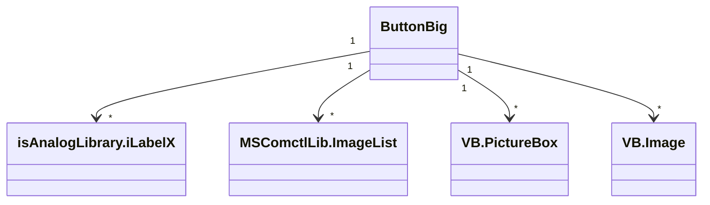

# Documentação do arquivo ButtonBig

## Introdução

Este arquivo contém o código para um controle de usuário personalizado no Visual Basic, que é um botão grande personalizado com várias funcionalidades.

## Dependências

Este arquivo depende das seguintes bibliotecas:

- `MSCOMCTL.OCX`
- `isAnalogLibrary.ocx`

## Estrutura

O arquivo possui uma estrutura de controle de usuário do Visual Basic, com várias propriedades, métodos e eventos definidos.

## Imports

Este arquivo não possui diretamente nenhuma importação.

## Variáveis

Este arquivo contém as seguintes variáveis:

- `m_ShowLed`: Usado para controlar a visibilidade de um LED no botão.
- `m_def_ShowLed` e `m_def_Active`: Constantes usadas para definir os valores padrão de `ShowLed` e `Active`.

## Métodos

Este arquivo contém os seguintes métodos:

- `ControlChanges()`: Usado para atualizar a aparência do botão dependendo se ele está ativado ou não.
- `UserControl_Initialize()`, `UserControl_Resize()`, `UserControl_ReadProperties()`, `UserControl_WriteProperties()`: Usados para inicializar, redimensionar e ler/gravar propriedades do controle de usuário.
- `iLabelX1_OnMouseDown()`, `iLabelX1_OnMouseUp()`: Usados para atualizar a aparência do botão quando o mouse é pressionado e solto.
- `UserControl_Click()`, `UserControl_MouseDown()`, `UserControl_MouseMove()`, `UserControl_MouseUp()`: Eventos do mouse definidos para o controle de usuário.

## Exemplo

Este controle de usuário pode ser usado em um formulário do Visual Basic, definindo suas propriedades e eventos conforme necessário.

## Diagrama de dependências

## Notas

Este é um controle de usuário do Visual Basic e, portanto, só pode ser usado em um projeto do Visual Basic.

## Vulnerabilidades

Não foram identificadas vulnerabilidades conhecidas neste arquivo.