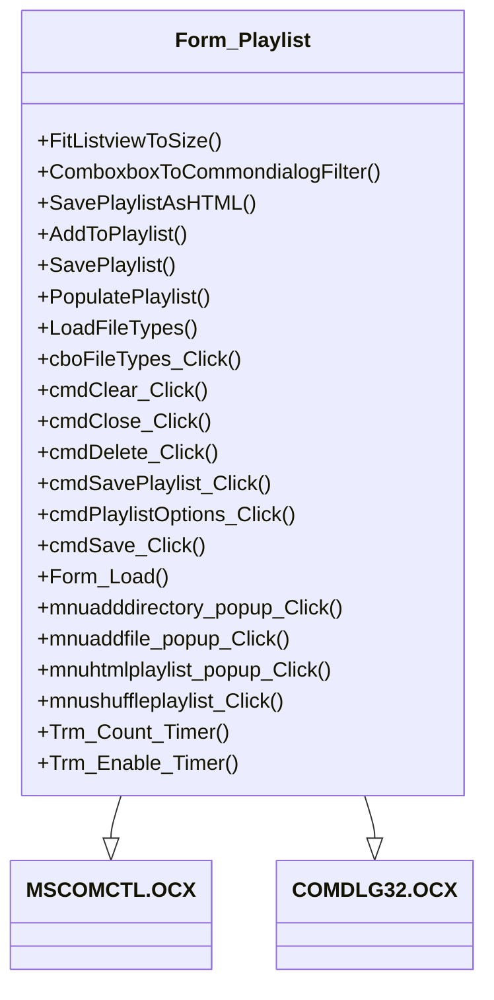

# Documentação do arquivo Form_Playlist

## Introdução

Este arquivo contém o código para a interface do usuário do formulário de lista de reprodução. O formulário permite ao usuário gerenciar a lista de reprodução, incluindo adicionar ou remover arquivos de música, salvar a lista de reprodução e reproduzir músicas.

## Dependências

Este arquivo depende das seguintes bibliotecas:

- MSCOMCTL.OCX
- COMDLG32.OCX

## Estrutura

O arquivo é estruturado em várias partes. No início, declarações de objeto são feitas para os controles usados no formulário, como botões, listas e caixas de combinação. Além disso, algumas constantes e variáveis são declaradas. Isto é seguido por definições de métodos para a funcionalidade do formulário.

## Imports

O arquivo não importa nenhum outro arquivo diretamente.

## Variáveis

O arquivo usa várias variáveis, incluindo:

- `DoneFitToSize`: Um booleano que verifica se a lista de reprodução já foi ajustada para caber no espaço disponível.
- `FileTypesToShow`: Uma string que contém os tipos de arquivo que devem ser mostrados na lista de reprodução.
- `strLocation`: Uma string que armazena a localização do arquivo atualmente selecionado na lista de reprodução.

## Métodos

O arquivo contém vários métodos, incluindo:

- `FitListviewToSize`: Ajusta a largura das colunas da lista de reprodução para caber no espaço disponível.
- `ComboxboxToCommondialogFilter`: Converte a string do tipo de arquivo selecionado em um filtro para a caixa de diálogo de abertura de arquivo.
- `SavePlaylistAsHTML`: Salva a lista de reprodução atual como um arquivo HTML.
- `AddToPlaylist`: Adiciona um arquivo ou diretório à lista de reprodução.
- `SavePlaylist`: Salva a lista de reprodução atual em um arquivo.
- `PopulatePlaylist`: Preenche a lista de reprodução com os arquivos de uma lista de reprodução salva.
- `LoadFileTypes`: Carrega os tipos de arquivo que podem ser adicionados à lista de reprodução.
- `cboFileTypes_Click`: Filtra a lista de reprodução para mostrar apenas arquivos do tipo selecionado.
- `cmdClear_Click`: Limpa a lista de reprodução.
- `cmdClose_Click`: Fecha o formulário de lista de reprodução.
- `cmdDelete_Click`: Remove o arquivo selecionado da lista de reprodução.
- `cmdSavePlaylist_Click`: Salva a lista de reprodução atual em um arquivo.
- `cmdPlaylistOptions_Click`: Abre o menu de opções da lista de reprodução.
- `cmdSave_Click`: Salva a lista de reprodução e fecha o formulário.
- `Form_Load`: Carrega a lista de reprodução salva quando o formulário é aberto.
- `mnuadddirectory_popup_Click`: Adiciona todos os arquivos em um diretório selecionado à lista de reprodução.
- `mnuaddfile_popup_Click`: Adiciona um arquivo selecionado à lista de reprodução.
- `mnuhtmlplaylist_popup_Click`: Salva a lista de reprodução atual como um arquivo HTML.
- `mnushuffleplaylist_Click`: Embaralha a ordem dos arquivos na lista de reprodução.
- `Trm_Count_Timer`: Atualiza o contador de músicas e a duração total da lista de reprodução.
- `Trm_Enable_Timer`: Ativa ou desativa os botões de opções da lista de reprodução com base no número de arquivos na lista.

## Exemplo

O arquivo é usado para gerenciar a lista de reprodução do aplicativo Audiostation. Ele permite ao usuário adicionar ou remover arquivos de música, salvar a lista de reprodução, reproduzir músicas e filtrar os tipos de arquivo exibidos.

## Diagrama de dependências

## Notas

Este arquivo é parte do aplicativo Audiostation.

## Vulnerabilidades

Não foram encontradas vulnerabilidades neste arquivo.