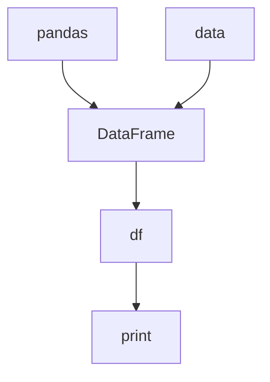

```python
# Importando a biblioteca pandas
import pandas as pd

# Criando um DataFrame a partir de um dicionário
data = {'Nome':['Tom', 'Nick', 'John', 'Julia'],
        'Idade':[20, 21, 19, 18]}

df = pd.DataFrame(data)

# Imprimindo o DataFrame
print(df)
```
---

# Documentação do arquivo pandas_example.py

## Introdução

Este arquivo contém um exemplo simples de como criar um DataFrame com a biblioteca pandas a partir de um dicionário. 

## Dependências

- pandas

## Estrutura

O arquivo contém uma única importação, a criação de um dicionário, a transformação deste dicionário em um DataFrame e a impressão deste DataFrame.

## Imports

- pandas

## Variáveis

- `data`: Um dicionário que contém duas listas, 'Nome' e 'Idade', com os nomes e idades, respectivamente.
- `df`: Um DataFrame que é criado a partir do dicionário `data`.

## Métodos

- `pd.DataFrame(data)`: Método do pandas para criar um DataFrame a partir de um dicionário.

## Exemplo

```python
# Importando a biblioteca pandas
import pandas as pd

# Criando um DataFrame a partir de um dicionário
data = {'Nome':['Tom', 'Nick', 'John', 'Julia'],
        'Idade':[20, 21, 19, 18]}

df = pd.DataFrame(data)

# Imprimindo o DataFrame
print(df)
```

## Diagrama de dependências



## Notas

- Este é um exemplo simples e não contém manipulação avançada de dados.

## Vulnerabilidades

- Não há vulnerabilidades conhecidas neste arquivo.