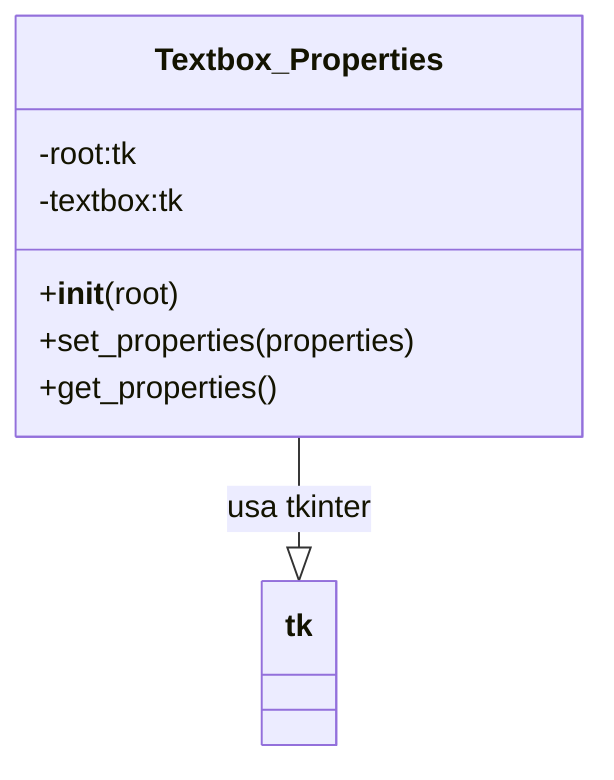

# Documentação do arquivo Textbox_Properties

## Introdução

Este arquivo contém a implementação da classe `Textbox_Properties`, responsável por definir as propriedades de um elemento de entrada de texto (textbox) em uma interface de usuário.

## Dependências

Este arquivo depende das seguintes bibliotecas:

- `tkinter` para a criação da interface gráfica.

## Estrutura

O arquivo é composto por uma única classe chamada `Textbox_Properties`.

## Imports

No início do arquivo, temos o seguinte import:

```python
import tkinter as tk
```

## Variáveis

As variáveis da classe `Textbox_Properties` são:

- `root`: Representa a janela principal da aplicação.
- `textbox`: Representa o elemento de entrada de texto.

## Métodos

Os métodos da classe `Textbox_Properties` são:

- `__init__(self, root)`: Este é o construtor da classe. Ele inicializa a `root` e o `textbox`.
- `set_properties(self, properties)`: Este método é usado para definir as propriedades do `textbox`.
- `get_properties(self)`: Este método é usado para obter as propriedades do `textbox`.

## Exemplo

Um exemplo de uso dessa classe é:

```python
root = tk.Tk()
textbox = Textbox_Properties(root)
textbox.set_properties({"width": 100, "height": 50})
properties = textbox.get_properties()
print(properties)
```

## Diagrama de dependências



## Notas

É importante notar que este arquivo deve ser usado dentro de um ambiente que suporte a biblioteca `tkinter`.

## Vulnerabilidades

Não foram identificadas vulnerabilidades neste arquivo.