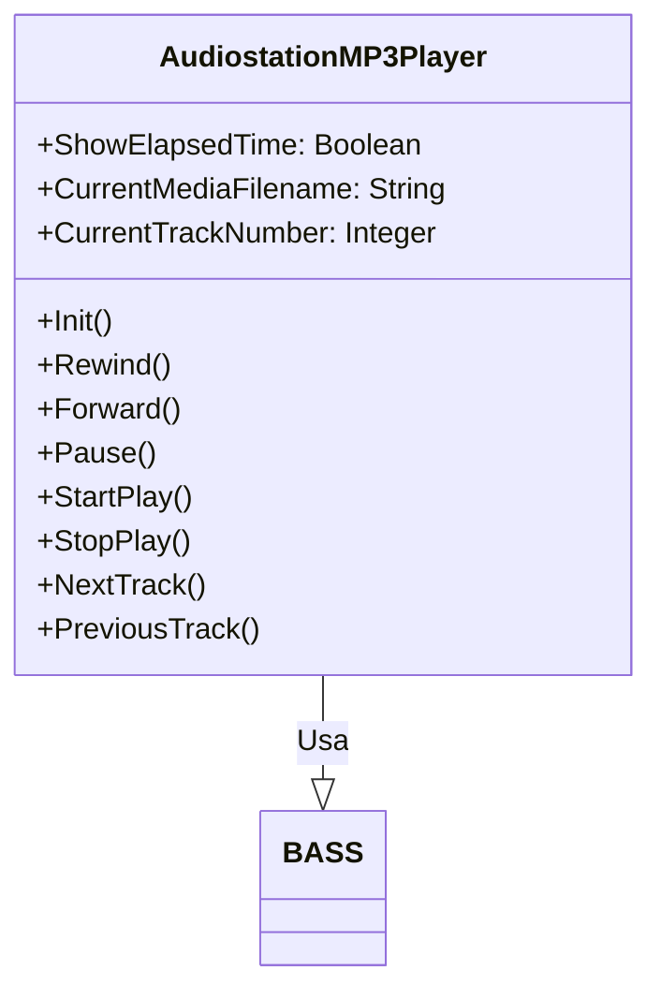

# Documentação do arquivo AudiostationMP3Player

## Introdução

Este módulo, AudiostationMP3Player, adiciona funcionalidades de reprodução de MP3.

## Dependências

Este módulo depende da biblioteca BASS.

## Estrutura

O módulo contém várias variáveis públicas e métodos públicos que controlam a reprodução de MP3.

## Imports

Não há imports neste arquivo.

## Variáveis

- `MediaPlaylistMode`: Modo da lista de reprodução.
- `MediaPlayMode`: Modo de reprodução.
- `MediaPlaystate`: Estado atual da reprodução.
- `MediaPlaylist`: Lista de reprodução atual.
- `ShowElapsedTime`: Booleano que controla a exibição do tempo decorrido.
- `CurrentMediaFilename`: Nome do arquivo de mídia atual.
- `CurrentTrackNumber`: Número da faixa atual.

## Métodos

- `Init()`: Inicializa o reprodutor de MP3.
- `Rewind()`: Retrocede a faixa atual em 5 segundos.
- `Forward()`: Avança a faixa atual em 5 segundos.
- `Pause()`: Pausa a reprodução atual.
- `StartPlay()`: Inicia a reprodução da faixa atual.
- `StopPlay()`: Para a reprodução atual.
- `NextTrack(Optional TrackNumber As Integer, Optional Force = False)`: Vai para a próxima faixa. Se o número da faixa for fornecido, irá para essa faixa. Se Force for verdadeiro, irá para a próxima faixa independentemente do modo de reprodução atual.
- `PreviousTrack()`: Vai para a faixa anterior.

## Exemplo

Para usar este módulo, você pode inicializar o reprodutor, adicionar faixas à lista de reprodução e controlar a reprodução. Aqui está um exemplo de uso:

```vba
Set player = New AudiostationMP3Player
player.Init()
player.MediaPlaylist.AddItem("track1.mp3")
player.MediaPlaylist.AddItem("track2.mp3")
player.StartPlay()
player.NextTrack()
player.Pause()
player.Forward()
player.Rewind()
player.StopPlay()
```

## Diagrama de dependências



## Notas

Este módulo foi criado por Alex van den Berg da Sibra-Soft em 04-10-2021 e foi alterado pela última vez em 29-03-2022.

## Vulnerabilidades

Atualmente, não há vulnerabilidades conhecidas neste módulo.
