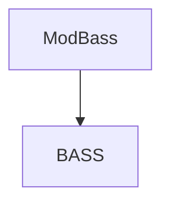

# Documentação do arquivo ModBass

## Introdução

ModBass é um módulo do Visual Basic para o BASS, uma biblioteca de som para Windows. Ele fornece uma interface para funções de áudio, como reprodução, gravação, amostragem e muito mais. 

## Dependências

O módulo depende da biblioteca BASS, que deve estar presente no sistema para que o módulo funcione corretamente.

## Estrutura

O arquivo contém constantes e declarações de funções para a biblioteca BASS. 

## Imports

O módulo não importa nenhum outro módulo ou biblioteca.

## Variáveis

O módulo define uma série de constantes que são usadas para configurar e controlar a biblioteca BASS.

## Dependências

Como mencionado anteriormente, este módulo depende da biblioteca BASS.

## Métodos

O módulo não define nenhum método.

## Exemplo

Um exemplo de uso do módulo seria criar uma aplicação que reproduz arquivos de música. O módulo fornece as funções necessárias para carregar e controlar a reprodução de arquivos de música.

## Diagrama de dependências

## Notas

Este módulo foi criado para ser usado com o Visual Basic 6.0.

## Vulnerabilidades

Não foram identificadas vulnerabilidades neste módulo.