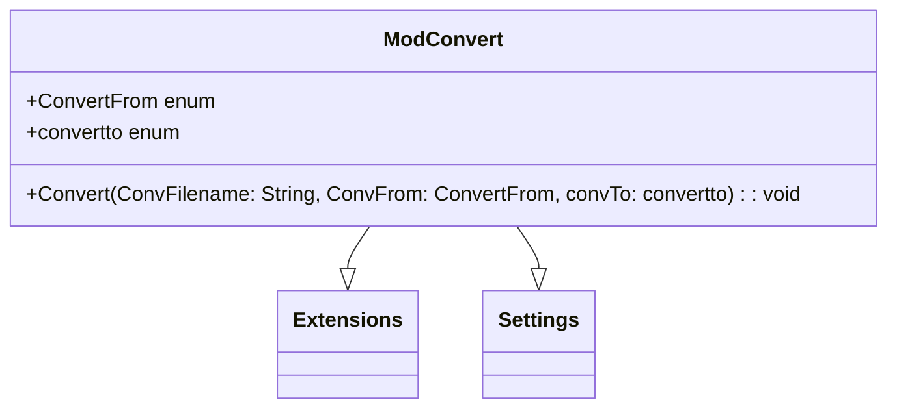

# Documentação do arquivo ModConvert

## Introdução

O arquivo "ModConvert" é responsável por converter arquivos de áudio de diversos formatos para os formatos MP3 e WAV.

## Dependências

Este arquivo depende do pacote 'ffmpeg.exe' para realizar as conversões de áudio.

## Estrutura

O arquivo contém duas enumerações, `ConvertFrom` e `convertto`, que definem os formatos de áudio dos quais e para os quais a conversão pode ser realizada, respectivamente. Além disso, define uma função `Convert` que realiza a conversão de um arquivo de áudio.

## Imports

Este arquivo não possui importações.

## Variáveis

O arquivo possui uma variável `CurrentFilename`, que é utilizada para armazenar o nome do arquivo que está sendo convertido.

## Métodos

O arquivo define uma função `Convert`. A função recebe três parâmetros: `ConvFilename` (o caminho do arquivo a ser convertido), `ConvFrom` (o formato do arquivo a ser convertido) e `convTo` (o formato para o qual o arquivo será convertido). A função chama a função `ShellAndWait` do módulo `Extensions` para executar o comando de conversão de áudio e, em seguida, chama a função `WriteSetting` do módulo `Settings` para escrever o caminho do arquivo convertido em uma configuração.

## Exemplo

Para usar a função `Convert`, forneça o caminho do arquivo a ser convertido, o formato do arquivo a ser convertido e o formato para o qual o arquivo será convertido, como mostrado abaixo:

```vba
Call Convert("C:\path\to\file.wav", ConvertFrom.[Windows Media], convertto.[MP3])
```

## Diagrama de dependências



## Notas

- A função `Convert` assume que o pacote 'ffmpeg.exe' está presente no mesmo diretório que o aplicativo.
- Os formatos de áudio aceitos para a conversão dependem dos formatos suportados pelo pacote 'ffmpeg.exe'.

## Vulnerabilidades

Não foram identificadas vulnerabilidades neste arquivo.