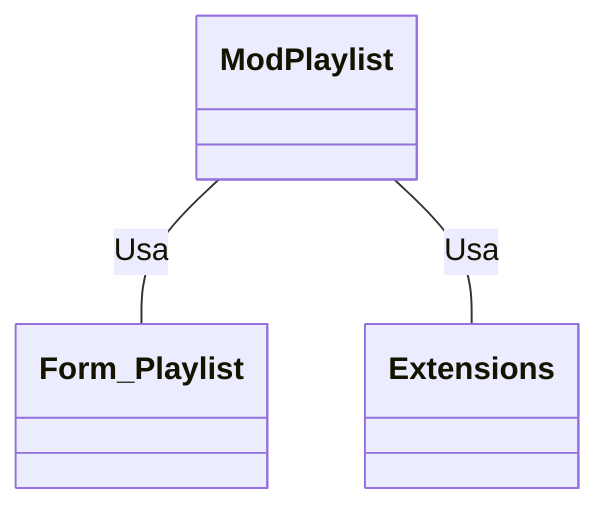

# Documentação do arquivo ModPlaylist
## Introdução
Este arquivo se destina a gerenciar as operações de diferentes tipos de playlists como APL, WPL, M3U e PLS. As operações incluem abrir e ler os arquivos de playlist.

## Dependências
Este arquivo depende da classe `Extensions` para ler os arquivos e do formulário `Form_Playlist` para adicionar itens à playlist.

## Estrutura
Este arquivo é composto por cinco funções públicas: `OpenAplPlaylist`, `OpenWplPlaylist`, `OpenM3uPlaylist`, `OpenPlsPlaylist`.

## Imports
Não há imports neste arquivo.

## Variáveis
As variáveis usadas em cada função são temporárias e são usadas para armazenar dados de arquivos ou valores de string temporários.

## Métodos
- `OpenAplPlaylist(strPlaylistFile As String)`: Abre e lê o conteúdo de um arquivo de playlist APL.
- `OpenWplPlaylist(FileName As String)`: Abre e lê o conteúdo de um arquivo de playlist WPL.
- `OpenM3uPlaylist(strPlaylistFile As String, Optional TargetListbox As ListBox)`: Abre e lê o conteúdo de um arquivo de playlist M3U. A listbox de destino é opcional.
- `OpenPlsPlaylist(strPlaylistFile As String, Optional TargetListbox As ListBox)`: Abre e lê o conteúdo de um arquivo de playlist PLS. A listbox de destino é opcional.

## Exemplo
Para abrir e adicionar um arquivo de playlist APL à playlist do formulário, você pode usar:
```vba
Call ModPlaylist.OpenAplPlaylist("caminho/para/arquivo.apl")
```
O mesmo pode ser feito para os outros tipos de arquivos de playlist (WPL, M3U, PLS).

## Diagrama de dependências


## Notas
Este arquivo não implementa nenhum tratamento de erro, então erros durante a leitura de arquivos ou adição à playlist podem resultar em falhas no programa.

## Vulnerabilidades
Não foram identificadas vulnerabilidades específicas neste arquivo. No entanto, a falta de tratamento de erros pode resultar em vulnerabilidades indiretas se os arquivos de entrada não estiverem no formato esperado.