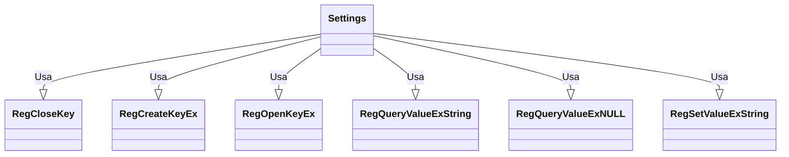

# Documentação do arquivo Settings

## Introdução

O arquivo "Settings" é responsável por manipular as configurações do software. Ele contém métodos que permitem ler e escrever configurações no registro do sistema.

## Dependências

Este arquivo não tem dependências externas.

## Estrutura

Este arquivo é composto por constantes e métodos. As constantes são usadas para definir valores fixos que são usados nos métodos. Os métodos são usados para interagir com o registro do sistema.

## Variáveis

Este arquivo não possui variáveis globais.

## Métodos

O arquivo possui dois métodos principais: "WriteSetting" e "ReadSetting".

### WriteSetting

Este método recebe quatro parâmetros: `sAppName`, `sSection`, `sKey` e `sSetting`. Ele é responsável por escrever uma configuração no registro do sistema.

### ReadSetting

Este método recebe quatro parâmetros: `sAppName`, `sSection`, `sKey` e `sDefault`. Ele é responsável por ler uma configuração do registro do sistema.

## Exemplo

Escrever uma configuração:

```vba
Call WriteSetting("MeuApp", "Config", "Chave", "Valor")
```

Ler uma configuração:

```vba
sValor = ReadSetting("MeuApp", "Config", "Chave", "Valor padrão")
```

## Diagrama de dependências



## Notas

Este arquivo usa a API do Windows para interagir com o registro do sistema. Além disso, ele usa manipulação de erros para garantir que os erros sejam tratados corretamente.

## Vulnerabilidades

Este arquivo não possui vulnerabilidades conhecidas.