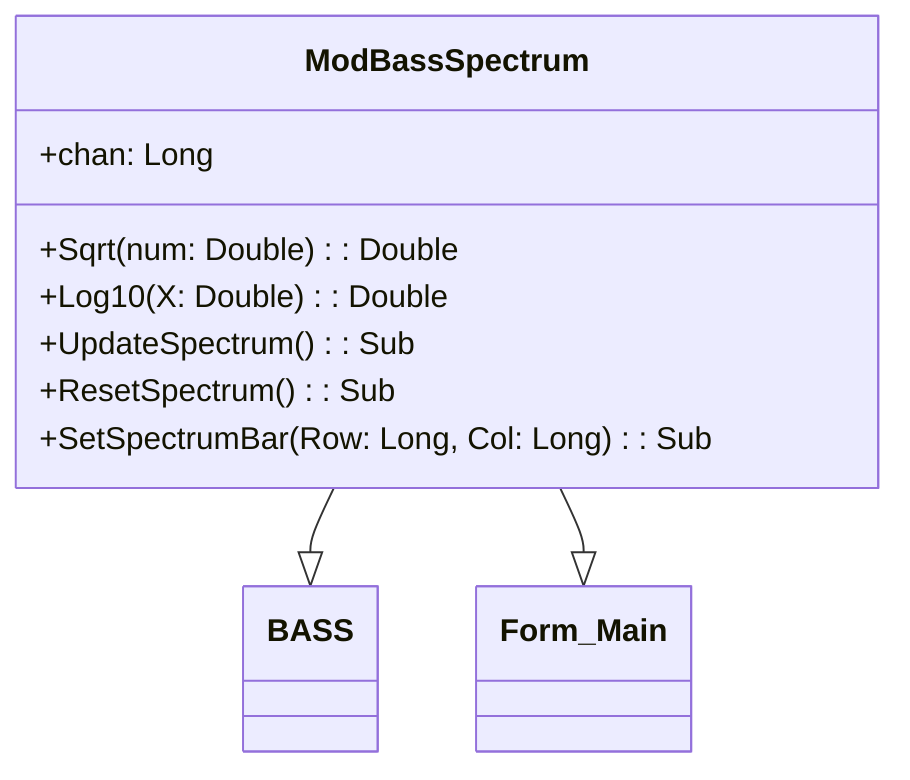

# Documentação do arquivo ModBassSpectrum

## Introdução

O arquivo ModBassSpectrum é um módulo que contém funções e métodos para lidar com espectro de áudio.

## Dependências

Este arquivo depende da biblioteca BASS e do Form_Main.

## Estrutura

O arquivo contém variáveis públicas, funções e sub-rotinas.

## Imports

Este arquivo não importa nenhum módulo ou biblioteca externa.

## Variáveis

- `chan`: Variável de tipo longa que armazena o canal de áudio.
- `fft`: Array de tipo Single usado para armazenar os dados do Fast Fourier Transform (FFT).

## Métodos

- `Sqrt(num)`: Esta função retorna a raiz quadrada de um número. Se ocorrer um erro, retorna 0.
- `Log10(X)`: Esta função retorna o logaritmo base 10 de um número.
- `UpdateSpectrum()`: Esta sub-rotina atualiza o espectro de áudio.
- `ResetSpectrum()`: Esta sub-rotina redefine o espectro de áudio.
- `SetSpectrumBar(Row, Col)`: Esta sub-rotina define a barra de espectro.

## Exemplo

Para usar este módulo, você deve inicializar o canal de áudio e, em seguida, pode chamar `UpdateSpectrum` para atualizar o espectro de áudio.

## Diagrama de dependências

## Notas

Este módulo é específico para lidar com espectro de áudio.

## Vulnerabilidades

Não foram identificadas vulnerabilidades neste arquivo.