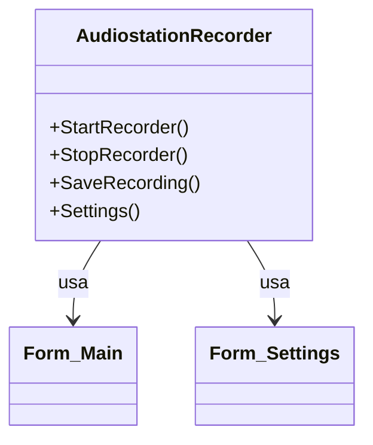

# Documentação do arquivo AudiostationRecorder

## Introdução

Este arquivo define a classe AudiostationRecorder. Ele é responsável por manipular as ações de gravação de áudio, como iniciar e parar a gravação, salvar a gravação e exibir as configurações.

## Dependências

Este arquivo é dependente do Form_Main e do Form_Settings.

## Estrutura

Este arquivo é composto por uma classe chamada AudiostationRecorder e quatro métodos: StartRecorder, StopRecorder, SaveRecording e Settings.

## Imports

Não existem importações neste arquivo.

## Variáveis

Não existem variáveis globais neste arquivo.

## Métodos

Este arquivo tem quatro métodos:

- `StartRecorder()`: Este método é responsável por iniciar a gravação.
- `StopRecorder()`: Este método é responsável por parar a gravação.
- `SaveRecording()`: Este método é responsável por salvar a gravação.
- `Settings()`: Este método é responsável por exibir as configurações.

## Exemplo

```vb
Dim recorder As New AudiostationRecorder
recorder.StartRecorder()
' Gravação em andamento...
recorder.StopRecorder()
recorder.SaveRecording()
recorder.Settings()
```

## Diagrama de dependências



## Notas

Nenhuma.

## Vulnerabilidades

Nenhuma vulnerabilidade conhecida.