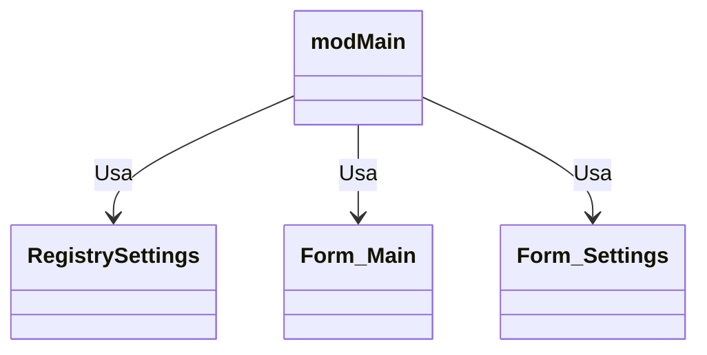

# Documentação do arquivo modMain

## Introdução

Este arquivo é o módulo principal do projeto. Ele contém a lógica principal e o ponto de entrada para a execução do programa.

## Dependências

Este arquivo depende da biblioteca `RegistrySettings` e das classes `Form_Settings` e `Form_Main`.

## Estrutura

O arquivo é estruturado em uma única subrotina pública, `Main`, que é executada quando o programa é iniciado.

## Imports

Não há importações neste arquivo.

## Variáveis

Este arquivo usa uma variável chamada `Settings` que é uma instância da classe `RegistrySettings`.

## Métodos

Este arquivo contém o método `Main`. Este método analisa o argumento da linha de comando e realiza várias ações com base nele, como parar e salvar a gravação ou abrir as configurações.

## Exemplo

Este arquivo é executado automaticamente quando o programa é iniciado, por isso não há um exemplo específico de uso.

## Diagrama de dependências

## Notas

Este arquivo não pode ser executado de forma independente, pois faz parte de um programa maior.

## Vulnerabilidades

Não há vulnerabilidades conhecidas neste arquivo.