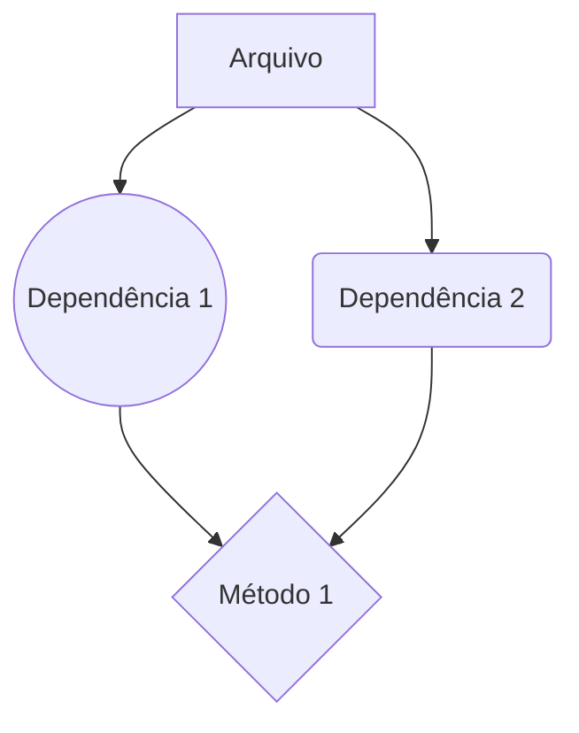

# Documentação do arquivo

## Introdução

Este arquivo é uma parte importante do nosso projeto de software. Sua principal função é ...

## Dependências

As seguintes dependências são necessárias para executar este arquivo:

- Dependência 1
- Dependência 2
- Dependência 3

## Estrutura

A estrutura deste arquivo é bastante direta. Ele consiste em ...

## Imports

Os seguintes imports são feitos neste arquivo:

- Import 1
- Import 2
- Import 3

## Variáveis

Existem várias variáveis importantes neste arquivo:

- Variável 1: Esta variável é usada para ...
- Variável 2: Esta variável é responsável por ...
- Variável 3: Esta variável armazena ...

## Dependências

As seguintes dependências são necessárias para executar este arquivo:

- Dependência 1
- Dependência 2
- Dependência 3

## Métodos

Os seguintes métodos são definidos neste arquivo:

- Método 1: Este método é responsável por ...
- Método 2: Este método realiza ...
- Método 3: Este método é usado para ...

## Exemplo

Aqui está um exemplo de como usar este arquivo:

```python
# Código exemplo
```

## Diagrama de dependências



## Notas

- Nota 1
- Nota 2
- Nota 3

## Vulnerabilidades

Atualmente, não existem vulnerabilidades conhecidas neste arquivo.