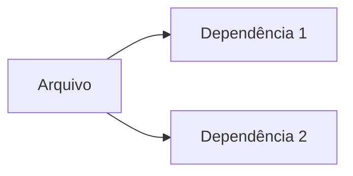

# Documentação do arquivo 

## Introdução

Este arquivo é uma parte crucial do projeto, responsável por (descrição do que o arquivo faz).

## Dependências

Este arquivo depende das seguintes bibliotecas:

1. Dependência 1
2. Dependência 2

## Estrutura

O arquivo é estruturado da seguinte maneira: (descrição da estrutura do arquivo)

## Imports

Os seguintes pacotes e bibliotecas são importados neste arquivo:

1. Import 1
2. Import 2

## Variáveis

As seguintes variáveis são declaradas e utilizadas neste arquivo:

1. Variável 1: (descrição da variável 1)
2. Variável 2: (descrição da variável 2)

## Métodos

Os seguintes métodos são definidos neste arquivo:

1. Método 1: (descrição do método 1)
2. Método 2: (descrição do método 2)

## Exemplo

Aqui está um exemplo de como este arquivo pode ser usado: 

```python
# Exemplo de código
```

## Diagrama de dependências

Aqui está um diagrama das dependências deste arquivo:



## Notas

Aqui estão algumas notas adicionais sobre este arquivo: (notas)

## Vulnerabilidades

Aqui estão algumas possíveis vulnerabilidades deste arquivo: (vulnerabilidades, se houver)